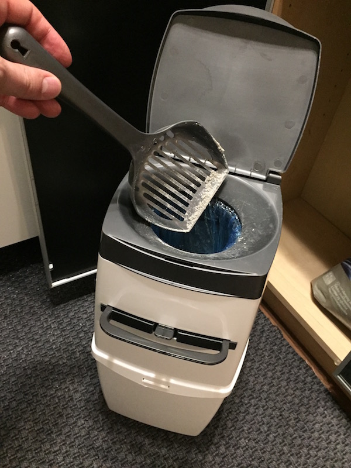
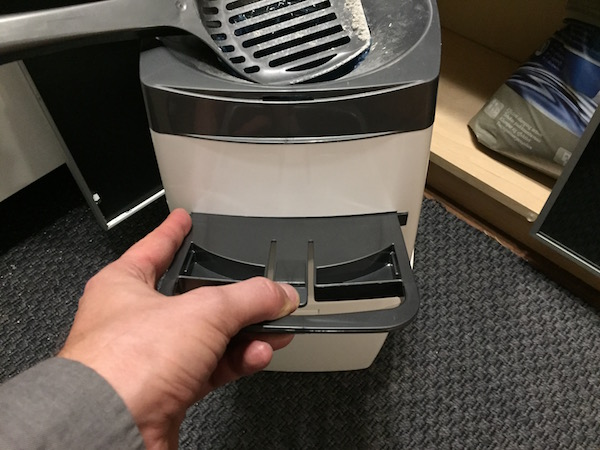

# Kissojen hoito-ohjeet

## Vessat

Kissojen vessat on rappusten yläpäässä kaapissa:

Kapealla ylähyllyllä on lapiot. Paskat sekä paakut laitetaan
oikealla olevan kirjahyllyn oven takana olevaan torniin:

Torniin laitetaan yläpäästä rojut:

Ja sitten ne "vedetään alas" vetämällä keskellä olevasta kahvasta:

Torni tulee varmaan täyteen ja siinä on se pussi siellä sisällä
loppu. Siksi ylähyllyllä on myös tavallisia
roskapusseja joihin voi laittaa kakat ja paakut kun torni on
täyttynyt. Pussit voi laittaa vessan roskikseen.

## Ruokkiminen

Pääosa ruoasta pitäisi tulla automaatista. Märkäruokaa on kissojen
puun ylemmässä kolossa:

Ja märkäruoan voi laittaa automaatin viereisen laatikon sisällä
oleviin astioihin:

Vesikipot kannattaa myös täyttää. Yläkerran vessassa on myös
vesiastia.

