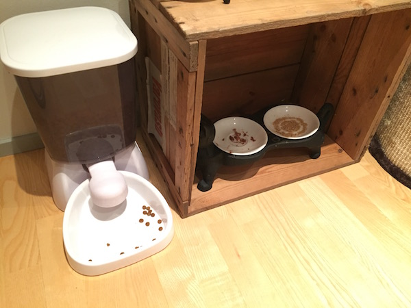

# Kissojen hoito-ohjeet

## Vessat

Kissojen vessat on rappusten yläpäässä kaapissa:

Kapealla ylähyllyllä on lapiot ja roskapussit. Pusseihin laitetaan
kakat ja paakut ja sitten pussit voi laittaa vessan roskikseen.

## Ruokkiminen

Pääosa ruoasta pitäisi tulla automaatista. Märkäruokaa on kissojen
puun ylemmässä kolossa:

Märkäruoan voi laittaa automaatin viereisen laatikon sisällä
oleviin astioihin:

Märkäruokaa ei kannata laittaa enempää kuin yksi purkki puoliksi
molemmille.

Vesikipot kannattaa myös täyttää. Yläkerran vessassa on myös
vesiastia.

